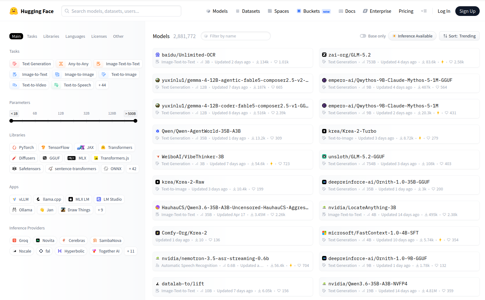
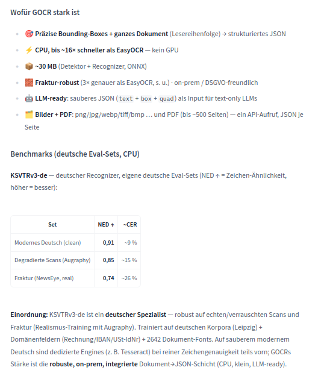

Hier gibt es eine kleine Einführung zur Nutzung von KI-Modellen von <a href="https://huggingface.co/">HuggingFace</a>.

# Was ist Hugging Face?

Hugging Face ist eine Webseite, des gleichnamigen US-amerikanischen Unternehmens <b>Hugging Face Inc.</b>. Bei der Webseite handelt es sich um eine Art Plattform für maschinelles Lernen, auf der Datensätze und Modelle bereitgestellt und heruntergeladen werden können.

# Was sind KI-Datensätze?

Ein KI-Datensatz ist die Grundlage für das Training und die (Weiter-)Entwicklung von Algroithmen, die im Bereich des Maschinellen Lernens (ML) und Künstlicher Intelligenz (KI) genutzt werden. 

# Was sind KI-Modelle?

Ein KI-Modell ist eine Art Programm, das anhand einer Reihe von Daten (dem Datensatz) trainiert wurde, um bestimmte Aufgaben, wie beispielsweise Mustererkennung, zu lösen. Man unterscheidet verschiedene Arten von KI-Modellen. Es gibt Klassifizierungsmodelle, Regressionsmodelle, generative Modelle oder auch Basismodelle ("Foundation Models")

## Wie finde ich KI-Modelle?

Modelle kann man auf verschiedene Weisen finden. Einer der einfachsten Wege ist über Hugging Face Modelle nach dem jeweiligen Anwendungssbereich auszuwählen.<br></br>
Es gibt auch andere Plattformen, die sich darauf spezialisiert haben, verfügbare Modelle aufzulisten. So zum Beispiel <a href="https://www.nele.ai/de/ki-modelle">nele.ai</a> oder auch <a href="https://cloud.google.com/use-cases/free-ai-tools?hl=de">Google</a>.

## Wie nutze ich KI-Modelle

{.lightbox}


### Image-to-Text-Modelle

{.lightbox}

### Image-to-Caption

* Image-to-Caption-Modell auf <a href="https://huggingface.co/GHonem/blip-image-captioning-base-test_sagemaker-tops-3">HuggingFace</a>

* wenig Informationen zu Datengrundlage und Zweck 
* Fähigkeiten: 
    * Bilder automatisch beschreiben
    * Objekte und Personen erkennen
    * Szenen in natürlicher Sprache zusammenfassen
    * Bildbeschreibungen für Suche und Barrierefreiheit erzeugen

#### Lokale Installation

**Voraussetzungen:**<br>
    * Python
    * Installation in virtueller Umgebung ratsam
    * Benötigte Softwarepakette: torch, torchvision, transformers, pillow, accelerate

**Installation:**<br>

1. a) Virtuelle Umgebung in Windows (via Terminal):

    ```
    python -m venv blip-env
    blip-env\Scripts\activate
    ```

    b) Virtueelle Umgebung in Linux/macOS:

    ```
     python3 -m venv blip-env
     source blip-env/bin/activate
    ```

2. Benötigte Software-Pakete installieren:

```
pip install torch torchvision transformers pillow accelerate
```

und 

```
pip install protobuf
```

3. Python-Skript für die Modellnutzung erstellen

```
from transformers import pipeline

pipe = pipeline(
    "image-to-text",
    model="Salesforce/blip-image-captioning-base"
)

result = pipe("bild.jpg")

print(result)

```

4. Skript verwenden 

```
python caption.py
```

* Das Modell wird von HuggingFace heruntergeladen. 
* Es wird lokal gespeichert.
* Anschließend wird das Bild analysiert. 